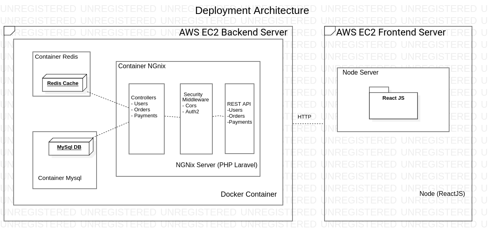

# The Yummi Pizza (Backend API)

This project is part of the test to work remotely at Innoscripta (created by Fidel Mamani Maquera). 

The Yummi Pizza web application allows users to register, login, and make order for pizzas, the app shows them pictures of pizzas available in The Yummi Pizza store with prices, users store the pizzas in a cart and pay for them using a fake credit card that is only allowed for testing which is delivered by Stripe Platform, the orders are registered in the database and can be accessed for users to see all the orders. 

## Architecture of the Complete Appication

This project has been designed with the microservice paradigm, so it uses docker containers to archestrate the complete pipeline for the  software development(development, testing, integration and deployment), where every single component of the architecture has a unique responsability and if a component fails, it could be repaired or replaced without a lot of effort. 

This project is using AWS EC2 as the deployment server, AWS EC2 hosts all the containers and every container runs separately and comunicate to each others inside the server. 

### Execution track of a single API (Register)
User requests register in the system to the frontend server (NodeJS, serve), request arrives to the backed server (Ngixn dockerized container), then it triggers CORS request to the middleware, middleware checks the Authorization policies, next the controllers handle the the register action and sending to the the DB Mysql by checking data formatting and properties. For security reasons, server uses JWT token to comunicate frontend and backend, by checking token authenticity in Redis DB in every single request. 

## Usage and Installation
This project was bootstrapped with Composer for [Laravel PHP](https://laravel.com/) 
* Installation 
    * Install Docker and Docker-compose from  [Docker](https://www.docker.com/) 
    * Create directories under storage directory 
    
    ├── storage 
        ├── framework 
            ├── cache 
            ├── sessions 
            ├── testing 

    * Give permissions for execution  to the project directory 
    * Execute command `composer install` 
    * Execute command `php artisan migration` to populate the Mysql DB 
* Usage 
    * Execute command `php artisan routes` to se all the routes. 
    * Execute command `php artisan route:api` to se all the api. 
    * All the endpoints are served at [http://localhost:3000](http://localhost:3000). 
